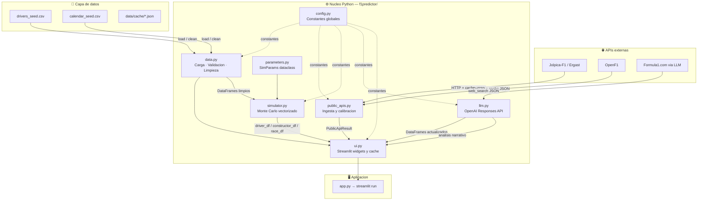
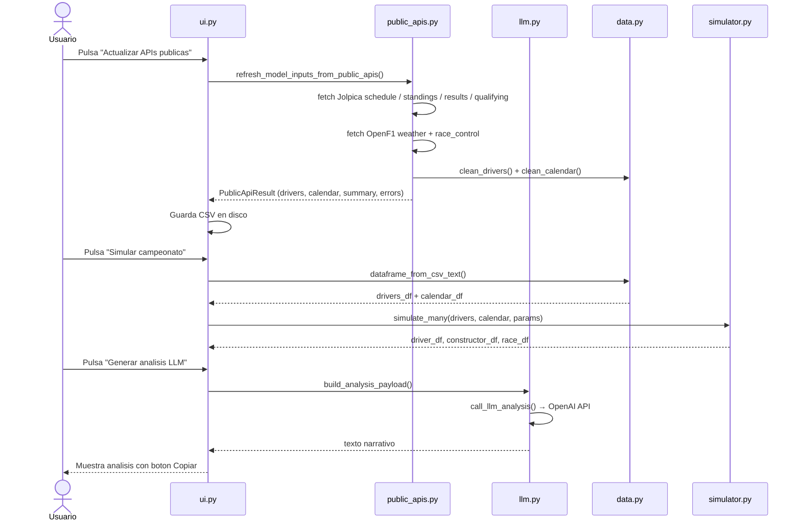
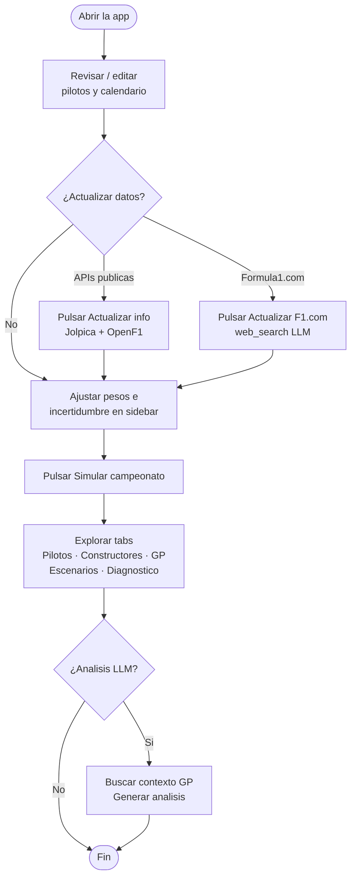

# F1 Championship Lab 🏎️

> **Autor:** Francisco Gonzalez — Quality Analytics


Aplicacion Streamlit para simular el campeonato de Formula 1 2026 combinando un motor Monte Carlo vectorizado, un modelo piloto/constructor multivariable, caracteristicas por circuito y una capa LLM que actualiza datos en vivo, busca contexto de carrera y convierte probabilidades en analisis narrativo.

---

## Indice

- [Que hace](#que-hace)
- [Arquitectura](#arquitectura)
- [Motor de simulacion](#motor-de-simulacion)
- [Flujo de datos](#flujo-de-datos)
- [Instalacion y uso](#instalacion-y-uso)
- [Flujo recomendado](#flujo-recomendado)
- [Parametros del modelo](#parametros-del-modelo)
- [Estructura del proyecto](#estructura-del-proyecto)
- [Por que este enfoque](#por-que-este-enfoque)
- [Fuentes principales](#fuentes-principales)

---

## Que hace

| Componente | Descripcion |
|---|---|
| **Monte Carlo de temporada** | Corre `N` simulaciones completas desde la ronda elegida; estima probabilidad de titulo, top 3, top 6 y puntos esperados para cada piloto y constructor. |
| **Modelo piloto/constructor** | Combina 13 ratings por piloto (habilidad, clasificacion, ritmo, consistencia, neumaticos, lluvia, racecraft…) con 5 atributos de equipo (ritmo, chasis, motor, estrategia, fiabilidad). |
| **Circuitos** | Cada GP modifica el modelo segun carga aerodinamica, potencia, degradacion, dificultad de adelantamiento, riesgo de clima y safety car, e importancia de clasificacion. |
| **Sprints** | Suma puntos de los sprints pendientes de forma configurable desde la barra lateral. |
| **Escenarios** | Calcula variantes Conservador / Base / Agresivo modificando forma, parrilla, caos e incertidumbre para comparar rangos de probabilidad de titulo. |
| **Diagnostico** | Tabla de explicabilidad que descompone fuerza piloto, fuerza constructora, forma efectiva, fit de circuito y ruido de carrera para los principales candidatos al titulo. |
| **APIs publicas** | El boton *Actualizar info* consulta Jolpica/Ergast y OpenF1, usa temporadas historicas como prior, recalibra ratings con resultados reales y guarda CSV en disco. |
| **Formula1.com via LLM** | El boton *Actualizar F1.com con LLM* usa `web_search` de OpenAI restringido a Formula1.com para line-up, standings y calendario oficial. |
| **LLM de contexto** | Busca noticias del proximo GP (clima, parrilla, upgrades, sanciones) y genera un veredicto narrativo sobre pilotos, constructores y escenarios. |
| **Datos editables y persistentes** | Pilotos y calendario viven en CSV editables desde la app; cualquier actualizacion los sobreescribe en disco. |

---

## Arquitectura



---

## Motor de simulacion

Cada iteracion Monte Carlo ejecuta el siguiente pipeline por carrera pendiente:

```mermaid
flowchart LR
    A([Inicio iteracion]) --> B[Calcular fuerza base\npiloto + constructor + forma]
    B --> C[Ajuste por circuito\ndownforce · power · tyres\nracecraft · strategy]
    C --> D{¿Lluvia?}
    D -- Si --> E[Bonus wet_skill]
    D -- No --> F[Sin ajuste]
    E & F --> G[Clasificacion\n+ ruido gaussiano]
    G --> H[Grid bonus\nsegun qualifying_importance]
    H --> I{¿Safety car?}
    I -- Si --> J[Ruido extra\n+ bonus strategy]
    I -- No --> K[Sin ajuste]
    J & K --> L[Ruido de carrera\nsegun consistency]
    L --> M{¿DNF?\nfiabilidad × estres pista}
    M -- Si --> N[Score = -999]
    M -- No --> O[Score final]
    N & O --> P[Ordenar finishing order]
    P --> Q[Asignar puntos\nF1 o Sprint]
    Q --> R([Siguiente carrera])
```



---

## Flujo de datos



---

## Instalacion y uso

### Requisitos previos

- [Miniconda](https://docs.conda.io/en/latest/miniconda.html) o Anaconda
- Python 3.11+

### Instalacion

```powershell
conda env create -f environment.yml
conda activate f1predictor
streamlit run app.py
```

### Variables de entorno (opcional — para LLM)

Crea un archivo `.env` en la raiz del proyecto:

```dotenv
OPENAI_API_KEY=tu_clave_aqui
OPENAI_MODEL=gpt-5.5
```

> Sin `OPENAI_API_KEY` la app funciona completamente; los botones LLM quedan deshabilitados.

---

## Flujo recomendado



---

## Parametros del modelo

### Pesos de fuerza

| Parametro | Rango | Default | Descripcion |
|---|---|---|---|
| `driver_weight` | 0.10 – 0.80 | **0.42** | Peso de habilidad del piloto en la fuerza base |
| `constructor_weight` | 0.10 – 0.80 | **0.48** | Peso del equipo (chasis + motor + estrategia) |
| `form_weight` | 0.00 – 0.30 | **0.06** | Peso inicial de la forma reciente |
| `form_decay_races` | 0.5 – 8.0 | **2.5** | Duracion de la forma reciente antes de diluirse |
| `qualifying_weight` | 0.20 – 1.20 | **0.72** | Cuanto arrastra la posicion de parrilla al ritmo de carrera |

### Incertidumbre

| Parametro | Rango | Default | Descripcion |
|---|---|---|---|
| `chaos` | 1.0 – 14.0 | **5.5** | Desviacion estandar del ruido de carrera |
| `reliability_multiplier` | 0.4 – 2.4 | **1.0** | Escala todas las probabilidades de abandono |
| `weather_multiplier` | 0.3 – 2.5 | **1.0** | Escala la probabilidad de sesion mojada |
| `safety_car_multiplier` | 0.3 – 2.5 | **1.0** | Escala la probabilidad de safety car |
| `development_drift` | 0.0 – 8.0 | **2.4** | Deriva de desarrollo de equipo a lo largo de la temporada |
| `team_uncertainty` | 0.0 – 10.0 | **6.0** | Incertidumbre persistente del paquete de cada equipo |

### Ratings de piloto (1 – 100)

`driver_rating` · `qualifying` · `race_pace` · `consistency` · `tyre_management` · `wet_skill` · `racecraft` · `team_pace` · `chassis` · `power_unit` · `strategy` · `reliability` · `recent_form`

---

## Estructura del proyecto

```
F1 Results/
├── app.py                    # Entry point: streamlit run app.py
├── environment.yml           # Entorno Conda
├── requirements.txt          # Dependencias pip
├── .env                      # (no versionado) OPENAI_API_KEY
│
├── data/
│   ├── drivers_seed.csv      # Ratings y puntos actuales de pilotos
│   ├── calendar_seed.csv     # Calendario con features de circuito
│   └── cache/                # Respuestas JSON cacheadas de APIs
│
├── docs/
│   └── research_f1_models.md # Sintesis de modelos e investigacion
│
└── f1predictor/
    ├── __init__.py
    ├── config.py             # Constantes: paths, URLs, puntos, colores
    ├── data.py               # Carga, validacion, limpieza y merge de datos
    ├── parameters.py         # SimParams: dataclass congelado con todos los controles
    ├── public_apis.py        # Ingesta Jolpica-F1 + OpenF1, calibracion de ratings
    ├── simulator.py          # Motor Monte Carlo vectorizado con NumPy
    ├── llm.py                # Integracion OpenAI Responses API (web_search + analisis)
    └── ui.py                 # Streamlit: sidebar, editores, graficos, LLM panel
```

---

## Por que este enfoque

La investigacion publica en F1 muestra que el constructor explica una fraccion dominante del resultado final, pero que clasificacion, circuito, clima, fiabilidad y el contexto especifico del fin de semana pueden cambiar sustancialmente el pronostico.

Este proyecto no intenta fingir precision de telemetria:

- **Transparente** — cada rating es un CSV editable; el modelo no tiene caja negra.
- **Calibrable** — los pesos y multiplicadores son sliders en tiempo real.
- **Actualizable** — dos botones traen datos reales (APIs REST y Formula1.com via LLM).
- **Narrativo** — el LLM convierte numeros en veredictos accionables.
- **Documentado** — todas las funciones siguen convencion NumPy docstring para facilitar la lectura del codigo y la generacion de documentacion.

La sintesis completa de modelos existentes, variables usadas y metodologia esta en [docs/research_f1_models.md](docs/research_f1_models.md).

---

## Fuentes principales

| Fuente | URL |
|---|---|
| F1 drivers 2026 | https://www.formula1.com/en/drivers |
| F1 standings 2026 | https://www.formula1.com/en/results/2026/drivers |
| F1 calendar 2026 | https://www.formula1.com/en/racing/2026 |
| Jolpica F1 API | https://github.com/jolpica/jolpica-f1 |
| FastF1 | https://docs.fastf1.dev/ |
| OpenF1 | https://openf1.org/docs/ |
| OpenAI web search | https://platform.openai.com/docs/guides/tools-web-search?api-mode=responses |
