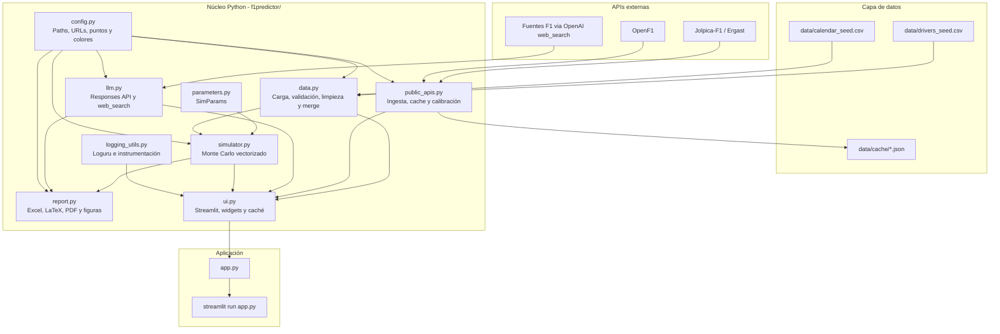
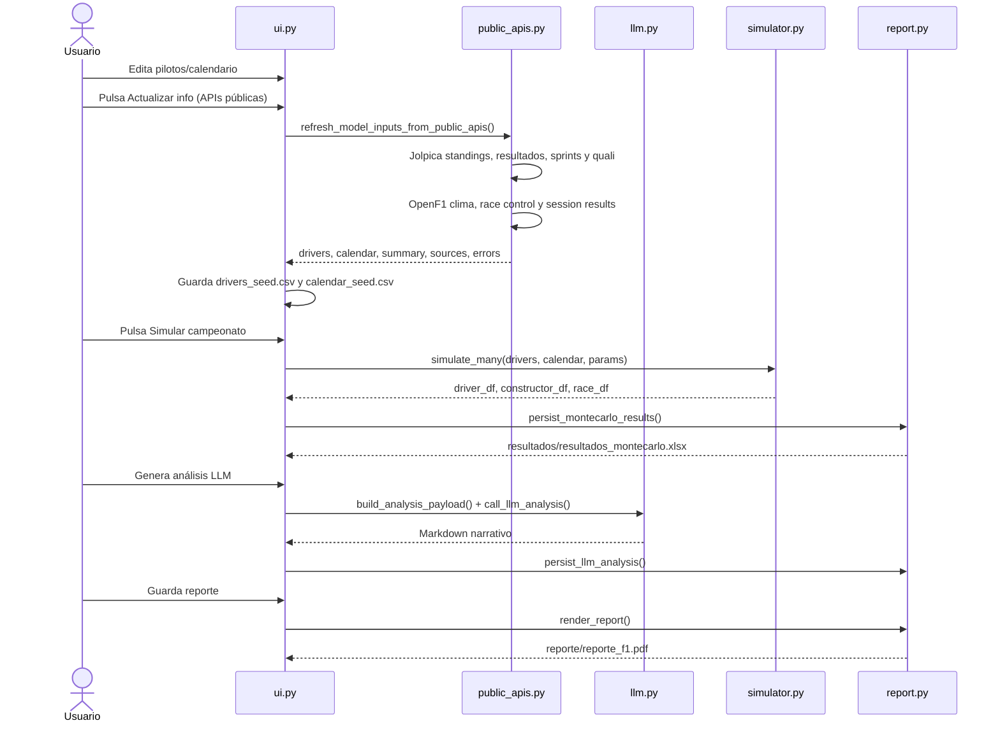

# F1 Championship Lab

> **Autor:** Francisco Gonzalez - Quality Analytics


Aplicación Streamlit para simular un campeonato de Fórmula 1 desde la temporada actual. Combina un motor Monte Carlo vectorizado, ratings editables de pilotos y constructores, características de circuito, actualización con APIs públicas y una capa LLM para búsqueda contextual, análisis narrativo y consulta de fuentes oficiales.

El proyecto también incluye salida persistente a Excel/PDF, bitácora con Loguru y un tablero Power BI (`Tablero/`) para explotar los resultados generados.

> Ver el tablero en línea: https://gamerinsightanalytics.com/f1-cockpit/

> **Disclaimer:** Este proyecto es para análisis de datos y simulaciones informativas. No constituye asesoramiento financiero ni de apuestas y no debe usarse como guía para apuestas.

---

## Índice

- [Qué hace](#qué-hace)
- [Arquitectura](#arquitectura)
- [Motor de simulación](#motor-de-simulación)
- [Flujo de datos](#flujo-de-datos)
- [Instalación y uso](#instalación-y-uso)
- [Variables de entorno](#variables-de-entorno)
- [Flujo recomendado](#flujo-recomendado)
- [Parámetros del modelo](#parámetros-del-modelo)
- [Salidas generadas](#salidas-generadas)
- [Estructura del proyecto](#estructura-del-proyecto)
- [Fuentes principales](#fuentes-principales)

---

## Qué hace

| Componente | Descripción |
|---|---|
| **Monte Carlo de temporada** | Corre `N` simulaciones completas desde la ronda elegida; estima probabilidad de título, top 3, top 6 y puntos esperados para pilotos y constructores. |
| **Modelo piloto/constructor** | Combina 13 ratings por piloto con atributos de equipo: ritmo, chasis, unidad de potencia, estrategia, fiabilidad y forma reciente. |
| **Circuitos** | Cada GP ajusta el rendimiento según carga aerodinámica, potencia, estrés de neumáticos, dificultad de adelantamiento, riesgo climático, safety car e importancia de clasificación. |
| **Sprints** | Asigna puntos de sprint pendientes cuando el parámetro `include_sprints` está activo. |
| **Escenarios e incertidumbre** | Permite controlar caos de carrera, fiabilidad, clima, safety car, deriva de desarrollo e incertidumbre del paquete por equipo. |
| **Diagnóstico** | Descompone probabilidades en fuerza del piloto, fuerza del auto, clasificación, forma regresada, ajuste de pista, ruido de carrera e incertidumbre. |
| **Datos editables** | Pilotos y calendario viven en CSV y pueden editarse desde la app con `st.data_editor`. |
| **Actualización por APIs** | Consulta Jolpica-F1/Ergast y OpenF1, cachea JSON en `data/cache/`, recalibra inputs y guarda los CSV actualizados. |
| **Búsqueda F1 con LLM** | Usa OpenAI Responses API con `web_search` para consultar fuentes confiables de F1 y actualizar standings, line-up o calendario. |
| **Análisis narrativo** | Genera contexto del próximo GP y un veredicto LLM sobre pilotos, constructores, riesgos y escenarios. |
| **Reporte** | Exporta resultados Monte Carlo a Excel y genera un informe LaTeX/PDF con gráficos Plotly y el análisis LLM persistido. |
| **Logging** | Registra ejecución, tiempos y excepciones con Loguru en `resultados/app.log`. |
| **Power BI** | Incluye un proyecto `.pbip` en `Tablero/` para visualizar los resultados producidos por la simulación. |

---

## Arquitectura



---

## Motor de simulación

Cada iteración Monte Carlo evalúa las carreras pendientes con este flujo:

```mermaid
flowchart LR
    A([Inicio]) --> B["Fuerza base<br/>piloto + constructor + forma"]
    B --> C["Ajuste por circuito<br/>downforce, power, tyres, racecraft, strategy"]
    C --> D{"¿Lluvia?"}
    D -- Sí --> E["Bonus wet_skill"]
    D -- No --> F["Sin ajuste climático"]
    E --> G
    F --> G
    G["Clasificación<br/>rating + ruido"] --> H["Grid bonus<br/>según qualifying_importance"]
    H --> I{"¿Safety car?"}
    I -- Sí --> J["Ruido adicional<br/>+ estrategia"]
    I -- No --> K["Ruido normal"]
    J --> L
    K --> L
    L["Ritmo de carrera<br/>consistencia + caos"] --> M{"¿DNF?"}
    M -- Sí --> N["Score = -999"]
    M -- No --> O["Score final"]
    N --> P
    O --> P
    P["Orden final"] --> Q["Puntos F1 o sprint"]
```



---

## Flujo de datos



---

## Instalación y uso

### Requisitos previos

- Miniconda o Anaconda
- Python 3.11
- Para PDF: una instalación LaTeX con `pdflatex` disponible en el `PATH`

### Opción Conda

```powershell
conda env create -f environment.yml
conda activate f1predictor
streamlit run app.py
```

### Opción pip

```powershell
python -m venv .venv
.\.venv\Scripts\Activate.ps1
pip install -r requirements.txt
streamlit run app.py
```

También puedes ejecutar `run_app.bat` en Windows.

---

## Variables de entorno

Crea un archivo `.env` en la raíz del proyecto para habilitar funciones LLM:

```dotenv
OPENAI_API_KEY=tu_clave_aqui
OPENAI_MODEL=gpt-4o
```

Variables opcionales de logging:

```dotenv
F1PREDICTOR_LOG_LEVEL=INFO
F1PREDICTOR_FILE_LOG_LEVEL=DEBUG
```

Sin `OPENAI_API_KEY`, la simulación, edición de datos, APIs públicas y exportación de resultados siguen funcionando; solo quedan deshabilitadas las funciones LLM.

---

## Flujo recomendado

1. Abrir la app con `streamlit run app.py`.
2. Revisar o editar `Pilotos` y `Calendario`.
3. Actualizar inputs con `Actualizar info (APIs públicas)` o `Búsqueda profunda F1 con LLM`.
4. Ajustar pesos e incertidumbre en la barra lateral.
5. Pulsar `Simular campeonato`.
6. Revisar pestañas de pilotos, constructores, carreras, diagnóstico y modelo.
7. Buscar contexto del próximo GP y generar análisis LLM si hay API key.
8. Guardar el reporte para producir PDF, Excel, figuras y Markdown.

---

## Parámetros del modelo

### Motor

| Parámetro | Default | Descripción |
|---|---:|---|
| `simulations` | `4000` | Iteraciones Monte Carlo. |
| `seed` | Año actual | Semilla reproducible de NumPy. |
| `start_round` | `4` | Primera ronda simulada hacia adelante. |
| `include_sprints` | `True` | Incluye puntos de sprints pendientes. |

### Pesos

| Parámetro | Rango | Default | Descripción |
|---|---:|---:|---|
| `driver_weight` | 0.10-0.80 | 0.42 | Peso de habilidad del piloto. |
| `constructor_weight` | 0.10-0.80 | 0.48 | Peso del equipo. |
| `form_weight` | 0.00-0.30 | 0.06 | Peso inicial de forma reciente. |
| `form_decay_races` | 0.5-8.0 | 2.5 | Carreras sobre las que se diluye la forma. |
| `qualifying_weight` | 0.20-1.20 | 0.72 | Arrastre de clasificación a ritmo de carrera. |

### Incertidumbre

| Parámetro | Rango | Default | Descripción |
|---|---:|---:|---|
| `chaos` | 1.0-14.0 | 5.5 | Ruido de carrera. |
| `reliability_multiplier` | 0.4-2.4 | 1.0 | Escala de abandonos. |
| `weather_multiplier` | 0.3-2.5 | 1.0 | Escala de sesiones mojadas. |
| `safety_car_multiplier` | 0.3-2.5 | 1.0 | Escala de safety car. |
| `development_drift` | 0.0-8.0 | 2.4 | Deriva de desarrollo durante la temporada. |
| `team_uncertainty` | 0.0-10.0 | 6.0 | Incertidumbre persistente del paquete por equipo. |

### Ratings de piloto y equipo

`driver_rating`, `qualifying`, `race_pace`, `consistency`, `tyre_management`, `wet_skill`, `racecraft`, `team_pace`, `chassis`, `power_unit`, `strategy`, `reliability`, `recent_form`.

---

## Salidas generadas

| Archivo / carpeta | Descripción |
|---|---|
| `resultados/resultados_montecarlo.xlsx` | Resultados de pilotos, constructores y probabilidades por GP. |
| `resultados/analisis_llm.md` | Último análisis narrativo generado por LLM. |
| `resultados/app.log` | Bitácora de ejecución con Loguru. |
| `reporte/reporte_f1.pdf` | Reporte final compilado con LaTeX. |
| `reporte/reporte_f1.tex` | TeX generado desde la plantilla. |
| `figs/*.png` | Gráficos Plotly exportados para el reporte. |
| `data/cache/*.json` | Respuestas cacheadas de Jolpica/OpenF1. |

---

## Estructura del proyecto

```text
F1 Results/
├── app.py                         # Entry point: streamlit run app.py
├── environment.yml                # Entorno Conda
├── requirements.txt               # Dependencias pip
├── run_app.bat                    # Lanzador Windows
├── .env                           # No versionado: OPENAI_API_KEY, logging, modelo
│
├── data/
│   ├── drivers_seed.csv           # Ratings y puntos actuales de pilotos
│   ├── calendar_seed.csv          # Calendario con features de circuito
│   └── cache/                     # Respuestas JSON cacheadas
│
├── docs/
│   └── research_f1_models.md      # Síntesis de investigación y modelos F1
│
├── resultados/
│   ├── analisis_llm.md            # Último análisis LLM
│   ├── resultados_montecarlo.xlsx # Último Excel de simulación
│   └── app.log                    # Logs de aplicación
│
├── reporte/
│   ├── reporte_f1_template.tex    # Plantilla LaTeX
│   ├── reporte_f1.tex             # TeX generado
│   └── reporte_f1.pdf             # PDF generado
│
├── figs/                          # Gráficos exportados
│
├── Tablero/
│   ├── Tablero F1.pbip            # Proyecto Power BI
│   ├── IMAGE_ATTRIBUTION.md       # Créditos de imágenes
│   ├── Tablero F1.Report/         # Definición del reporte
│   └── Tablero F1.SemanticModel/  # Modelo semántico
│
└── f1predictor/
    ├── __init__.py
    ├── config.py                  # Constantes, paths, URLs, puntos, colores
    ├── data.py                    # Carga, validación, limpieza y actualización
    ├── logging_utils.py           # Configuración Loguru e instrumentación
    ├── parameters.py              # SimParams
    ├── public_apis.py             # Jolpica/OpenF1, cache y calibración
    ├── simulator.py               # Motor Monte Carlo
    ├── llm.py                     # OpenAI Responses API
    ├── report.py                  # Excel, figuras, LaTeX y PDF
    └── ui.py                      # Interfaz Streamlit
```

---

## Fuentes principales

| Fuente | URL |
|---|---|
| Formula 1 drivers | https://www.formula1.com/en/drivers |
| Formula 1 results | https://www.formula1.com/en/results |
| Formula 1 calendar | https://www.formula1.com/en/racing |
| Jolpica F1 API | https://github.com/jolpica/jolpica-f1 |
| OpenF1 | https://openf1.org/docs/ |
| FastF1 | https://docs.fastf1.dev/ |
| OpenAI web search | https://platform.openai.com/docs/guides/tools-web-search?api-mode=responses |

La justificación metodológica del enfoque está documentada en [`docs/research_f1_models.md`](docs/research_f1_models.md).
